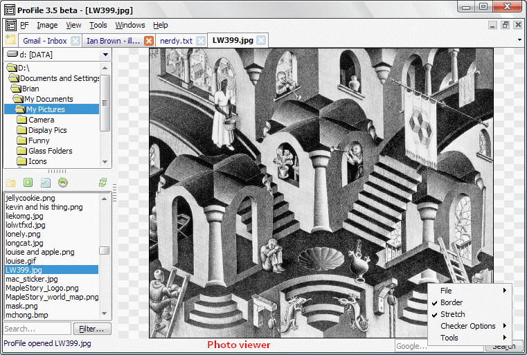



## App ProFile V3\.5

### Description

OCX-independent project, covering Media, Imaging, Text editing, Web browsing, etc. You can do all of that at once without opening other programs. This project also demonstrates usage of custom tabs, playlist parsing, DOM structures and more.
 
### More Info
 

             |
---                |---
**Submitted On**   |2008-01-02 10:37:36
**By**             |[Brian Lai](https://github.com/Planet-Source-Code/PSCIndex/blob/master/ByAuthor/brian-lai.md)
**Level**          |Advanced
**User Rating**    |5.0 (10 globes from 2 users)
**Compatibility**  |VB 6\.0
**Category**       |[Complete Applications](https://github.com/Planet-Source-Code/PSCIndex/blob/master/ByCategory/complete-applications__1-27.md)
**World**          |[Visual Basic](https://github.com/Planet-Source-Code/PSCIndex/blob/master/ByWorld/visual-basic.md)
**Archive File**   |[App\_ProFil2096831102008\.zip](https://github.com/Planet-Source-Code/brian-lai-app-profile-v3-5__1-69897/archive/master.zip)

### API Declarations

See code

